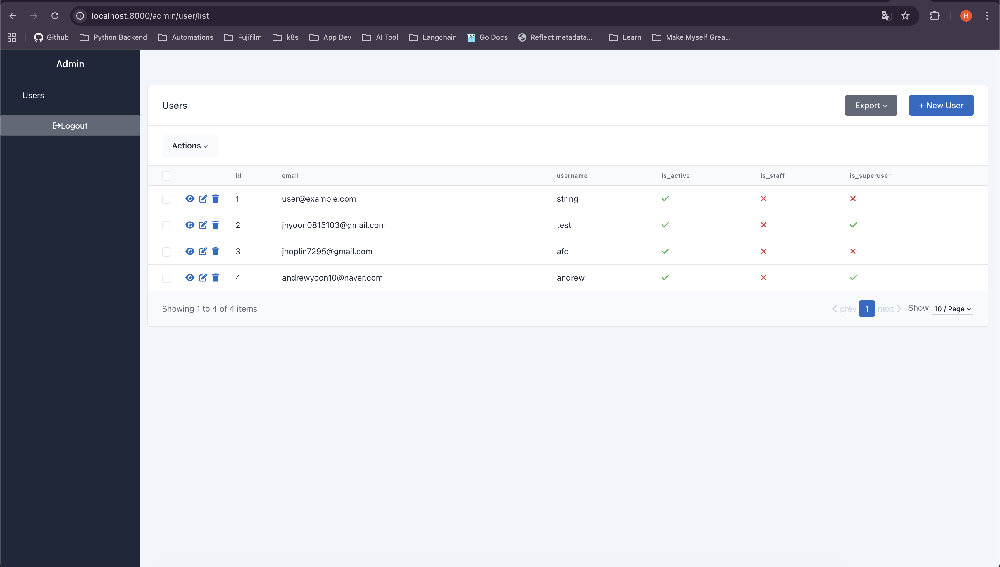
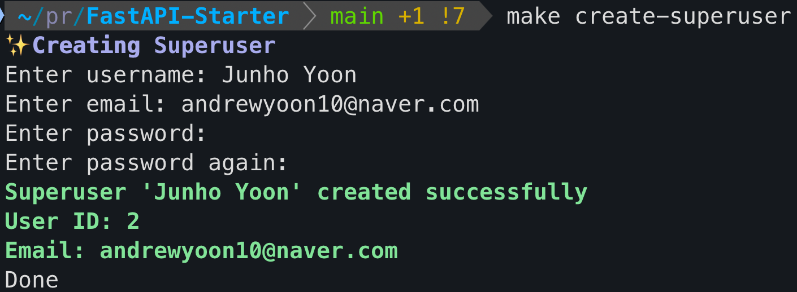

# Hoplin FastAPI Starter

FastAPI base code with modern Python & FastAPI pattern and Dependency Injection pattern with following 3 Layer Architecture.

Leveraged techniques described below

## Language & Frameworks

- Python 3.12
- Package Manager: [uv](https://docs.astral.sh/uv/)
- Framework: [FastAPI](https://fastapi.tiangolo.com/ko/)
- Application Command: [Typer](https://typer.tiangolo.com/)
- Dependency Injection System: [python-dependency-injector](https://python-dependency-injector.ets-labs.org/)
- Docker
- Code Linter: [Pre Commit](https://pre-commit.com/)

## Data Persistent


- Database: MySQL 8.0+
- ORM: [SQLAlchemy 2.0 with fully Asynchronous Support](https://www.sqlalchemy.org/)
- Migration Tool: [Alembic with async base](https://alembic.sqlalchemy.org/en/latest/)
- Database Driver: Aio-MySQL
- Management: [SQLAdmin](https://aminalaee.github.io/sqladmin/)


# About More

## Already Implemented

- JWT Base Authorization
- SignIn/SignUp
- User List/Retrieve (Only superuser or staff)
  - `role_granted_user` defined in [`apps.core.auth.context`](apps/core/auth/context.py)



## Create Superuser and commands

This base code grants special privileges only to users marked as superuser or staff, allowing them to access specific endpoints and manage the application (e.g., the admin page).
To create a superuser, you can use the pre-built command included in this application, available through both make and the Python module run command.

```text
# Use make

make create-superuser

# Python module run command

python -m apps.commands.create_superuser
```

Execution Example



Check out the [README.md](apps/commands/Readme.md) for more information on the pre-built commands in this application.

## Admin Page

This base code provide model admin page with [`SQLAdmin`](https://aminalaee.github.io/sqladmin/).
**Admin page access requires a user account with superuser or staff privileges. Users without either of these cannot log in.**

- Endpoint: `/admin`

## Swagger & Swagger Protection

In this base code, Swagger is protected with authentication.
**Swagger page access requires a user account with superuser or staff privileges. Users without either of these cannot log in.**

- Endpoint: `/docs/swagger`

## Relevant documents on concepts leveraged in this base code

Refer to [ReadMe.md](apps/core/Readme.md) in `apps.core`

## Start application without Docker (Recommended)

`make run` starts the application with Uvicorn, using uvloop as the event loop. This provides better performance compared to the default asyncio event loop.


## Start Application with docker

Start the project with Docker using:

```
docker compose up -d

docker compose down
```

## Others

- Setup Local Environment including uv install

    ```
    make setup
  ```

- Make migrations

    ```
     make migration m="(migration message required)"
    ```
